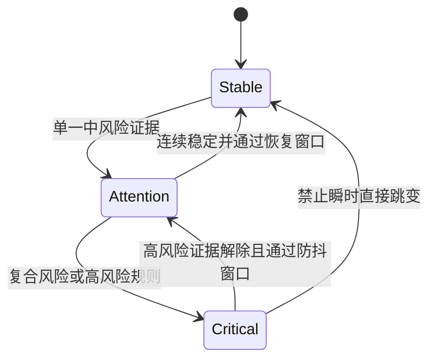

# 风险状态规范

> 风险等级仅用于教学原型的信息优先级实验，不代表真实车辆功能安全等级。

## 1. 三态定义

| 状态 | 典型触发 | 主文案结构 | 视觉策略 | 声音策略 | 交互策略 |
|---|---|---|---|---|---|
| 低风险 / Stable | 无显著道路或驾驶员风险 | “当前通勤状态稳定” | 冷色、低干扰、完整信息 | 无 | 全部Demo入口可用 |
| 中风险 / Attention | 单一风险或需要关注的趋势 | “注意：前车距离变化” | 琥珀色边框、风险卡片抬升 | 最多一次轻提示 | 保留必要操作，弱化非驾驶内容 |
| 高风险 / Critical | 行人+分心等复合风险 | “前方行人，注意力偏移” | 高对比红色、扩大主提示、压缩次要信息 | 一次短促提示+简短语音 | 暂停报告浏览和复杂操作 |

## 2. 状态字段

每个风险状态必须可追溯到统一事件：

```json
{
  "event": "pedestrian_and_distraction",
  "level": "high",
  "timestamp": 125.6,
  "message": "前方检测到行人且驾驶员注意力偏移",
  "evidence": ["前方行人", "驾驶员注意力偏移"]
}
```

## 3. 文案层级

1. 状态词：稳定 / 注意 / 高风险；
2. 事件结论：前方行人，注意力偏移；
3. 动作提示：请立即关注前方；
4. 证据：行人、前车风险、分心、疲劳；
5. 详细解释：只在事件详情或行程报告出现。

## 4. 文案示例

| 场景 | 推荐 | 避免 |
|---|---|---|
| 前车风险 | 注意前车距离 | 系统检测到前方可能存在某种潜在风险，请注意 |
| 车道偏离 | 检测到车道偏离趋势 | 您的车辆即将发生危险偏离 |
| 分心 | 注意力偏移，请关注前方 | 系统认为您不专心 |
| 复合风险 | 前方行人，注意力偏移 | 行人检测成功，分心检测成功，当前风险等级为高 |
| 系统降级 | 摄像头不可用，已切换Mock | 检测正常 |

## 5. 状态转换



## 6. 防抖与恢复建议

- 单帧检测不直接触发持续高风险；
- 相同事件在时间线按“事件类型+时间戳”去重；
- 高风险解除后先进入中风险观察态，再恢复稳定；
- 不用持续闪烁表达高风险；
- 用户确认提示不等于风险已经解除；
- 任何阈值和持续时间都需要后续实验，不在PreDesign阶段伪造结论。

