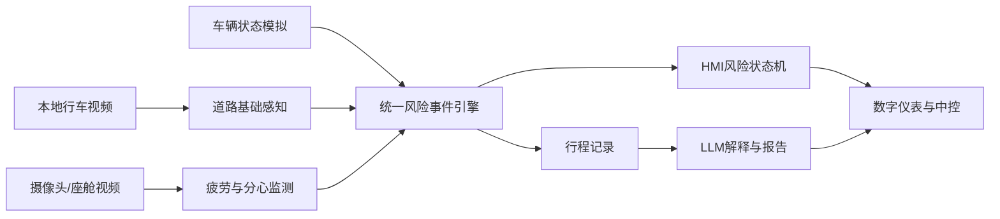

# 本科毕业设计选题报告初稿 Demo

> 状态：历史草稿，基于早期城市通勤风险方案。当前多屏HMI方向确认后需要重新编写，不应直接提交。

> **内部讨论稿 / 非正式提交版**  
> 学校或专业正式模板：当前工作区未发现。本文使用通用结构，仅供学生与指导教师讨论。  
> 学生姓名：【待填写】　学号：【待填写】　班级：【待填写】  
> 指导教师：【待填写】　日期：2026年【待填写】月【待填写】日

## 1. 课题名称

主选题：**面向城市通勤风险感知的智能座舱HMI多模态交互原型设计与实现**

技术型备选：**基于计算机视觉与大语言模型的城市通勤智能座舱HMI交互原型设计与实现**

建议使用主选题。主选题突出真实场景、研究对象和产品形态，避免将第三方技术工具直接写成项目创新。

## 2. 选题来源

暂定为：**学生自主选题 / 专业实践型选题**，最终由指导教师和专业审核确定。

当前没有材料证明本课题来自具体企业。学校企业命题采集表仅含示例行，因此本报告不将其表述为企业真实命题。

## 3. 项目类型

数字媒体技术专业理工类毕业设计，成果类型为：系统开发 + HMI交互原型 + 技术文档 + 测试评价 + 展示材料。

## 4. 研究背景

智能座舱中的道路信息、驾驶员状态和车辆状态通常由不同模块产生。若这些信息相互割裂，HMI容易维持固定布局和固定优先级，难以针对“道路风险与驾驶员分心同时发生”等复合情形及时调整视觉、声音和内容组织。同时，基于大语言模型的车载助手如果缺乏结构化数据约束，可能产生与真实事件不一致的解释。

学校2027届毕业设计以“智艺·新境”为总主题，将智能座舱与车载数字体验列为学部重点统筹方向；数字媒体技术专业指南同时推荐人工智能与数字人、智能座舱与车载交互等方向，并明确不建议只调用AI接口或制作简单网页。因此，本课题拟从数字媒体技术“技术 + 设计 + 内容 + 智能”的综合能力出发，完成一个可运行、可测试和可展示的纯软件智能座舱原型。

## 5. 研究意义

### 5.1 实践意义

- 将道路、驾驶员和车辆状态统一为可解释的风险事件；
- 研究HMI如何按风险等级动态调整信息优先级和反馈方式；
- 建立从感知、事件、交互到行程报告的完整软件链路；
- 形成适合毕业展演和就业作品集展示的系统成果。

### 5.2 教学与研究意义

课题不追求真实车辆级安全能力，而是在教学验证范围内比较不同事件组合、提示策略和LLM边界，形成可复现实验、失败案例和设计反思，为后续智能座舱HMI研究提供原型基础。

## 6. 目标用户与应用场景

目标用户为日常城市通勤驾驶者。核心场景包括城市道路跟车、行人出现、车道偏离趋势、驾驶员闭眼、打哈欠、视线偏移或分心，以及这些状态的复合出现。

典型情境：晚高峰中，前方检测到行人，同时驾驶员注意力偏离。系统将其判断为高风险复合事件，压缩次要信息、提升警告优先级、提供简短解释并记录到行程时间线。

## 7. 需要解决的核心问题

道路环境信息、驾驶员状态信息和座舱交互信息相互分散，固定式HMI难以根据复合风险动态调整信息优先级和反馈方式；同时，LLM需要在不虚构事实、不越权控制车辆的前提下解释结构化风险事件。

## 8. 研究与设计目标

1. 建立车辆、道路和驾驶员状态的数据协议；
2. 设计统一风险事件表达和可解释复合风险规则；
3. 设计低、中、高风险下的数字仪表和中控HMI状态；
4. 实现本地视频、模拟车辆状态、风险事件与HMI的实时联动；
5. 实现受结构化数据和白名单工具约束的LLM解释及行程总结；
6. 通过功能、性能、事件判断、LLM和用户测试评价系统。

## 9. 主要研究内容

- 城市通勤用户场景与风险任务分析；
- 智能座舱HMI信息架构、状态和反馈策略；
- 道路目标、车道和驾驶员状态的基础检测；
- 时间戳、风险证据、等级和来源统一建模；
- 复合风险规则与事件去重/防抖；
- 实时前后端通信与结构化行程记录；
- LLM工具调用、风险解释和报告一致性检查；
- 离线演示、量化评测和用户测试。

## 10. 系统功能范围

### P0 必须完成

数字仪表、中控HMI、车辆状态模拟、本地视频导入、基础车辆/行人/车道检测、疲劳监测、风险事件引擎、HMI风险联动和结构化行程记录。

### P1 重要功能

LLM工具调用、风险解释、语音输入/播报、AI驾驶报告、风险事件时间线和视频时间点定位。

### P2 加分项

目标跟踪、复合规则优化、HMI主题、报告PDF和桌面封装。

## 11. 系统架构

系统采用React/TypeScript前端和FastAPI/Python后端。车辆模拟器、本地道路视频和座舱摄像头分别产生车辆、道路和驾驶员状态；后端统一风险引擎生成结构化事件，通过WebSocket驱动HMI；行程记录作为LLM解释和报告的唯一事实来源。

## 12. 技术路线

1. 先以Mock事件完成车辆状态—风险判断—HMI—报告的最小闭环；
2. 使用OpenCV读取本地视频并进行帧采样；
3. 使用预训练目标检测模型识别基础车辆和行人；
4. 使用基础图像方法或轻量模型实现车道检测；
5. 使用MediaPipe人脸关键点估计闭眼、打哈欠和视线/头姿变化；
6. 转换为统一道路状态和驾驶员状态；
7. 通过显式规则生成风险等级和证据；
8. 使用WebSocket驱动HMI状态变化；
9. 使用JSON Schema/Pydantic约束LLM工具参数和报告事实；
10. 开展自动测试、性能测试和用户测试。

## 13. HMI设计方法

以驾驶核心信息优先、风险分级、减少视觉负担和可解释为原则：

- 低风险保持稳定冷色和低打扰；
- 中风险用琥珀色提升事件卡片，避免过度闪烁；
- 高风险压缩次要信息，以高对比警告、简短语音和明确证据提示；
- 同一风险只保留必要信息，避免视觉、声音和语言重复造成负担；
- 通过任务完成率、警告理解率、操作时间和用户反馈评价。

## 14. 风险事件建模方法

统一事件包含事件类型、风险等级、时间戳、提示文本、证据和来源。规则示例：

- 行人出现 + 驾驶员分心 → 高风险；
- 车道偏离 + 高疲劳 → 高风险；
- 单一前车风险、分心或中疲劳 → 中风险；
- 无风险证据 → 低风险。

研究重点是事件统一表达、复合判断、HMI状态映射和可解释证据，而不是将预训练模型调用表述为创新。

## 15. LLM应用边界

LLM仅处理结构化风险事件和行程数据，用于：风险原因解释、白名单工具调用、语音问答和行程总结。禁止直接控制车辆、执行任意系统命令、修改传感器事实或生成记录中不存在的结论。无密钥或调用失败时使用Mock模板，保证离线演示。

## 16. 拟解决的关键技术问题

1. 异步视频、驾驶员状态与车辆信号的时间对齐；
2. 短时抖动、重复检测和复合风险的稳定判断；
3. 风险等级到HMI信息层级和多模态反馈的映射；
4. LLM工具参数校验、事实一致性和失败降级；
5. CPU模式下的端到端延迟和展演稳定性。

## 17. 项目创新点

1. **道路风险与驾驶员状态的统一事件表达和复合风险判断**：以统一证据结构连接不同感知来源，并提供可解释规则。
2. **基于风险等级的HMI信息优先级与反馈方式动态调整**：将风险事件映射为仪表、中控、颜色、声音和语言策略。
3. **LLM面向结构化风险事件的解释、工具调用和行程总结**：限定事实来源和工具权限，降低幻觉与越权风险。

## 18. 可行性分析

### 技术可行性

当前主机具有约32 GB内存和RTX 4070 Laptop 8 GB显存，但系统默认以CPU和Mock模式运行。早期Demo已经实现前后端通信、车辆状态模拟、事件规则、HMI联动和Mock报告。视觉与LLM模块均以可替换适配器接入，不阻塞核心系统。

### 时间可行性

项目采用P0/P1/P2分级。2026年7月完成早期闭环，9—11月集中完成P0，12月冻结展演版，2027年完成实验和论文，符合工作方案节点。

### 数据与合规可行性

先使用自建Mock事件；真实视频和模型在使用前记录来源、授权、隐私与许可。涉及人脸或用户测试时取得知情同意，不提交私人数据、权重和密钥。

## 19. 测试与评价方案

- 视觉：Precision、Recall、F1、FPS、推理延迟、漏检和误报；
- 驾驶员状态：各状态准确率、触发与恢复延迟、光照和眼镜失败案例；
- 风险事件：场景覆盖率、等级正确率、复合风险识别率和端到端警告延迟；
- LLM：工具调用成功率、参数正确率、无效调用率和报告事实一致性；
- HMI：任务完成率、操作时间、错误次数、警告理解率、满意度和用户意见；
- 软件：单元、API、前端、连续运行、断网和离线降级测试。

所有结果必须来自真实实验；本初稿不预填任何模型指标、样本量或用户数据。

## 20. 预期成果

1. 可运行的数字仪表和中控HMI；
2. 车辆状态模拟器和视频输入链路；
3. 道路与驾驶员状态基础检测模块；
4. 统一风险事件和HMI联动系统；
5. LLM解释、工具调用与行程报告模块；
6. 源码、锁文件、需求、架构、测试和使用说明；
7. 演示视频、展板、二维码/本地展示入口和离线备用包；
8. 毕业论文或设计报告及过程材料。

## 21. 展演与演示方式

使用笔记本或展览电脑运行本地前后端，以数字仪表、中控画面、驾驶员状态、事件时间线和行程报告完成5—8分钟演示。核心场景为“前方行人 + 驾驶员分心”。准备完整录屏、静态截图、Mock事件和构建产物，保证无网络、无LLM密钥、无摄像头时仍可展示。

## 22. 进度计划

| 官方时间节点 | 工作内容 |
|---|---|
| 2026-07-01—07-20 | 选题、早期Demo、学校要求映射 |
| 2026-07-20—07-31 | 确认跨专业组队和个人成果边界 |
| 2026-07-31—10月中下旬 | 开题报告、HMI设计和技术验证 |
| 2026-09-30—11-30 | 系统设计、P0开发、功能和论文初稿 |
| 2026-12-10前 | 系统原型阶段终稿、视频和展示材料 |
| 2026年12月 | 毕业设计作品展 |
| 2027-02-28前 | 论文初稿提交 |
| 2027-03-22前 | 定稿、查重、格式和AIGC检测 |
| 2027年3月下旬 | 中期检查 |
| 2027年4月 | 终稿、答辩和材料归档 |

## 23. 风险与应对方案

| 风险 | 应对 |
|---|---|
| 视频和模型依赖复杂 | Mock先行，视觉适配器后接入 |
| 夜间/遮挡导致误检 | 分场景测试，记录失败案例，不夸大能力 |
| 复合规则误报 | 时间窗口、防抖、阈值配置和消融实验 |
| LLM幻觉或越权 | 结构化输入、白名单工具、参数校验和Mock降级 |
| 展演电脑无网络/GPU | CPU模式、本地资源、录屏和静态备份 |
| 范围失控 | P0优先，P2仅在主链路稳定后开发 |
| 数据与隐私问题 | 授权记录、脱敏、知情同意和最小化保存 |
| 个人成果边界不清 | 当前按个人课题；组队后重新备案独立分工 |

## 24. AI辅助使用说明

AI可用于资料线索整理、代码建议、测试用例、语言润色和界面创意，但不替代个人调研、设计、开发、测试和写作。每次使用记录工具、提示词、生成内容、人工修改、修改理由、测试结果和相关文件/Git提交。任何AI给出的引用、数据和指标必须通过原始来源核验。

## 25. 参考文献与资料来源

### 学校政策与要求

1. 数字艺术学部：《数字艺术学部2027届本科毕业论文（设计）工作方案》，2026年6月。
2. 数字艺术学部：《2027届本科毕业论文（设计）大主题与选题指南》，2026年6月。
3. 数字媒体技术专业：《2027届数字媒体技术专业毕业设计选题方向指南》，2026年。

### 已核验研究文献

4. Yang, G., Ahmed, M. M., & Subedi, B. (2020). Distraction of Connected Vehicle Human–Machine Interface for Truck Drivers. *Transportation Research Record*, 2674(9). https://doi.org/10.1177/0361198120929692
5. Farooq, A., Evreinov, G., & Raisamo, R. (2019). Reducing driver distraction by improving secondary task performance through multimodal touchscreen interaction. *SN Applied Sciences*, 1, 905. https://doi.org/10.1007/s42452-019-0923-4
6. Mulvihill, C., Horberry, T., Fitzharris, M., et al. First-stage evaluation of a prototype driver distraction Human-Machine-Interface warning system. https://doi.org/10.33492/JRS-D-21-00049
7. Lachance-Tremblay, J., Tkiouat, Z., Léger, P.-M., et al. (2025). A gaze-based driver distraction countermeasure: Comparing effects of multimodal alerts on driver's behavior and visual attention. *International Journal of Human-Computer Studies*, 193, 103366. https://doi.org/10.1016/j.ijhcs.2024.103366
8. Abbasi, E., Li, Y., Liu, Y., & Zhao, R. (2024). Effect of human–machine interface infotainment systems and automated vehicles on driver distraction. *Human Factors and Ergonomics in Manufacturing & Service Industries*. https://doi.org/10.1002/hfm.21049
9. Ebel, P., Orlovska, J., Hünemeyer, S., et al. (2023). On the forces of driver distraction: Explainable predictions for the visual demand of in-vehicle touchscreen interactions. *Accident Analysis & Prevention*, 183, 106956. https://doi.org/10.1016/j.aap.2023.106956

### 官方技术资料

10. Google AI for Developers. MediaPipe Face Landmarker Python API. https://ai.google.dev/edge/api/mediapipe/python/mp/tasks/vision/FaceLandmarker
11. Ultralytics. YOLO Python Usage. https://docs.ultralytics.com/usage/python
12. FastAPI. WebSockets. https://fastapi.tiangolo.com/advanced/websockets/
13. React. Using TypeScript. https://react.dev/learn/typescript
14. Vite. Getting Started. https://vite.dev/guide/
15. OpenAI. Function Calling in the OpenAI API. https://help.openai.com/en/articles/8555517
16. National Highway Traffic Safety Administration. Assessing the Feasibility of Vehicle-Based Sensors to Detect Drowsy Driving. DOT HS 811 886. https://www.nhtsa.gov/document/assessing-feasibility-vehicle-based-sensors-detect-drowsy-driving

## 待检索与确认

- 适用于车载HMI视觉注意与警告设计的ISO/国内标准，需通过学校数据库或导师确认正式版本；
- 适合本课题的公开道路视频和驾驶员状态数据集及其展示许可；
- 学校正式开题报告模板、AIGC说明模板和最终查重/检测要求。
