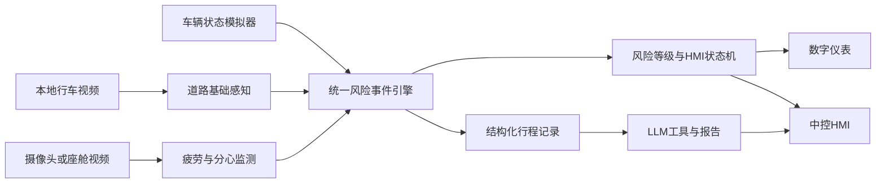
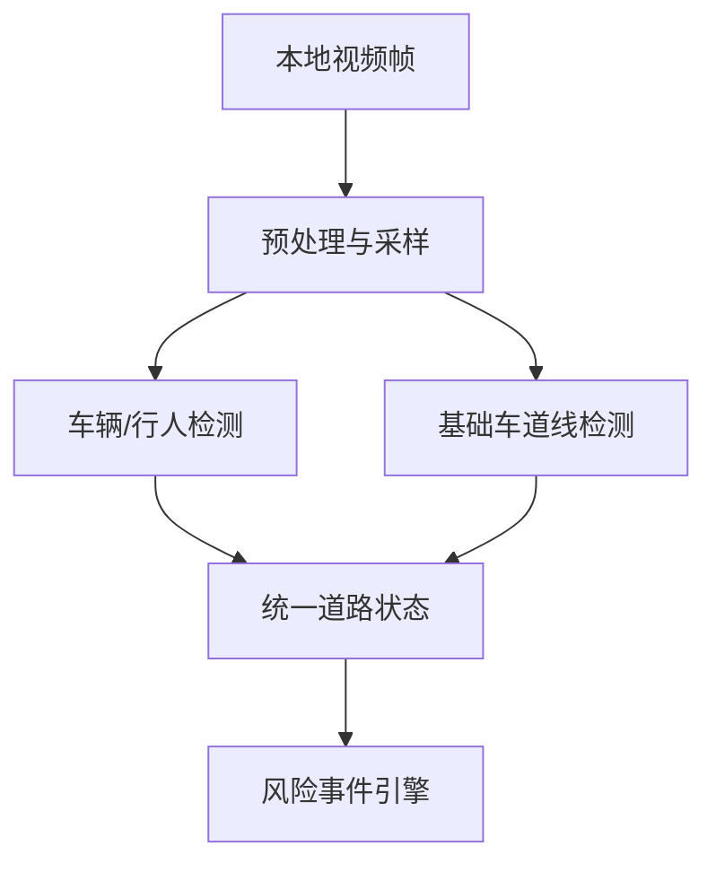
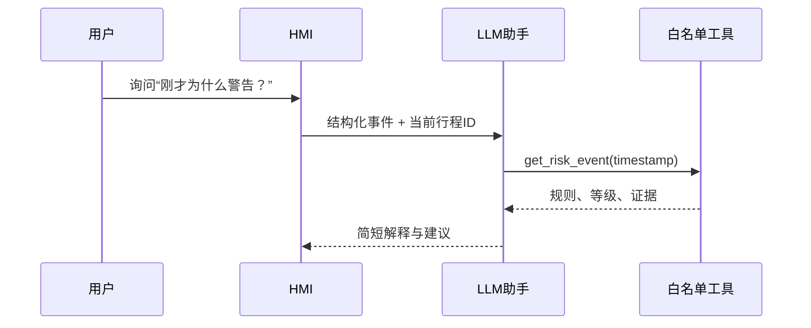

# 系统架构设计

> 状态：早期道路风险原型架构，可作为实时状态与离线Mock技术基线，不代表最终多屏HMI架构。

## 总体架构

## 数据流

1. 输入层产生带时间戳的车辆、道路和驾驶员状态；
2. 适配器统一字段、单位和置信度；
3. 风险引擎使用显式规则生成`RiskEvent`；
4. HMI状态机按低/中/高风险调整颜色、位置、声音和信息优先级；
5. 行程记录保存输入摘要、规则结果和证据；
6. LLM只能读取结构化事件并调用白名单工具，不直接访问车辆控制。

## 道路感知流程

早期Demo用`demo-data/mock/events.json`替代真实推理；下一阶段接入算法时不改变事件协议。

## 驾驶员监测流程

摄像头/视频 → 人脸关键点 → 眼部、嘴部和头部特征 → 时间窗口平滑 → 闭眼/打哈欠/视线偏移/分心状态 → `DriverState`。

不进行情绪识别，不保存人脸身份模板。涉及真实参与者时先取得知情同意并进行数据最小化。

## 风险事件引擎

当前以可解释规则为主，例如：

- 行人出现 + 驾驶员分心 → 高风险；
- 车道偏离 + 高疲劳 → 高风险；
- 前车中风险、单独分心或中疲劳 → 中风险；
- 无显著证据 → 低风险。

规则、阈值和证据均记录，便于消融实验和答辩解释。后续可在不改变HMI接口的情况下替换或优化规则。

## HMI联动

| 风险 | 信息策略 | 视觉/声音策略 |
|---|---|---|
| 低 | 保持驾驶核心信息 | 冷色、低打扰、无语音 |
| 中 | 提升风险卡片和证据 | 琥珀色、一次提示、避免持续闪烁 |
| 高 | 压缩次要信息、突出动作建议 | 红色高对比、短促声音与语音解释 |

## LLM工具边界

允许工具：读取风险事件、读取车辆模拟状态、生成行程摘要。禁止工具：车辆控制、文件任意写入、任意命令执行和未经确认的联网操作。

## 报告生成

行程结束 → 去重与聚合事件 → 统计风险次数和延迟 → 形成事实数据 → LLM生成自然语言 → 程序校验数字与引用事件 → 输出报告。无密钥时由Mock模板生成并明确标识。
